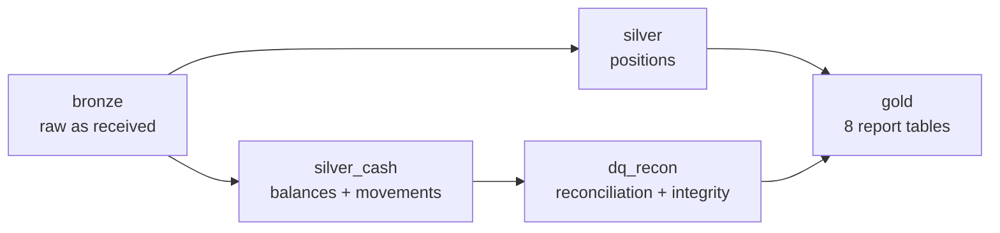
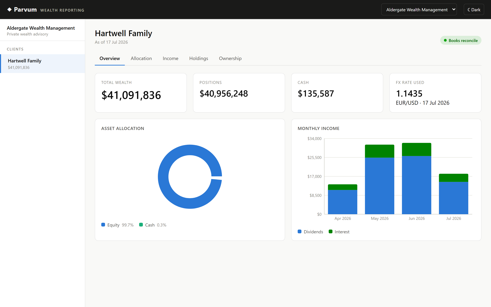
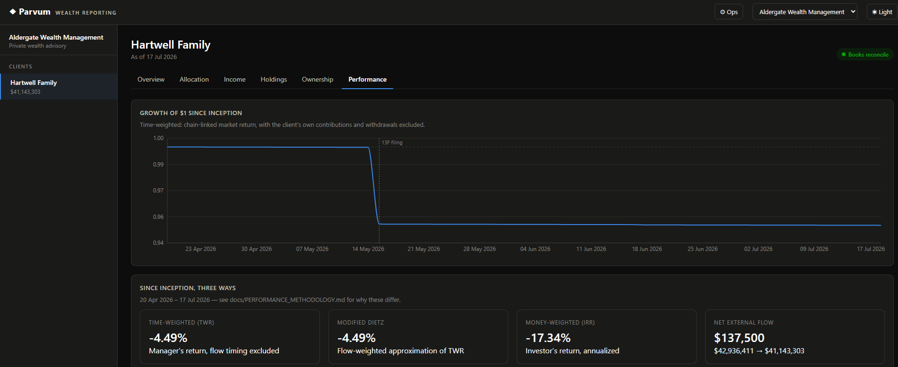
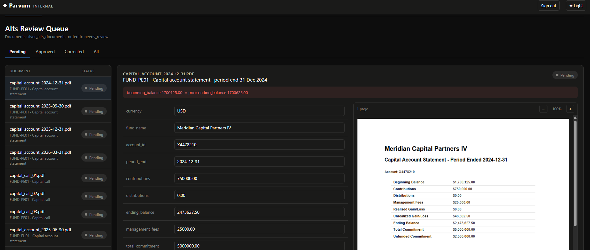

# Parvum — a wealth-data platform reference build

[](https://github.com/ambarshukla/parvum/actions/workflows/ci.yml)

A small, honest reference implementation of a wealth-management data platform,
built end-to-end from open and synthetic data: custodial feeds in **real wire
formats** → normalisation against a **securities master** → **reconciliation &
data-quality control** → a **total-portfolio view** served by Java web
services and a React dashboard — plus a human-in-the-loop pipeline for
alternatives documents, all deployed on cloud infrastructure defined as code.

The feeds are synthetic but the *formats* are real (ISO 20022, SWIFT MT),
seeded with real reference data and real SEC 13F holdings, with defects
injected deliberately — because the defects are what drive reconciliation
and data-quality work in practice.

**Live:**

[parvum-dashboard.vercel.app](https://parvum-dashboard.vercel.app) — the client wealth dashboard, open.

[parvum-internal.vercel.app](https://parvum-internal.vercel.app/?demo=1) — the internal tools
(data-ops scorecard and the alts review queue). These are back-office screens, not client-facing
ones, so they sit behind a login rather than in the dashboard above — but the link above signs a
viewer straight in via a public demo credential (D-059), so there's nothing to type or request.

## Architecture

```mermaid
flowchart LR
    subgraph acq [GitHub Actions — fetch half, open egress]
        FG["Feed generator<br/>5 accounts · semt.002 / MT535 / camt.053<br/>+ injected defects"]
        EXT["SEC 13F filings · ECB FX rates"]
    end
    ALTS["Synthetic alts PDFs<br/>capital calls · distributions · statements"] --> LLM["LLM extraction<br/>confidence + cross-document validation"]

    acq -->|"land raw files (CLI/API)"| UC[("Unity Catalog<br/>landing volume")]
    LLM -->|land| UC

    subgraph dbx [Databricks Free Edition — Delta Lake · Workflows]
        B["Bronze<br/>raw as received"] --> S["Silver<br/>conformed · ID-mapped · owner-attributed"]
        S --> DQ["Reconciliation & DQ<br/>graded vs defect manifests"]
        SA["Silver alts<br/>auto-accept / needs-review"]
        S --> G["Gold<br/>portfolio + performance views"]
        DQ --> G
        SA --> G
    end
    UC -->|file-arrival trigger| B
    UC --> SA

    G -->|export| PG[("Postgres<br/>schema-per-tenant + internal")]
    PG --> API["Quarkus + jOOQ REST<br/>AWS ECS Express Mode"]
    API --> WEB["Client dashboard<br/>Vercel"]
    API --> INT["Internal app · review queue<br/>Vercel"]
    INT -.->|"reviewed decision → land file"| UC
```



The client-facing path runs left to right; the dashed edge is the
human-in-the-loop returning a reviewed alts decision to the lakehouse as a
landed file (the serving app never writes to Delta — it stays the system of
record).

### The Databricks Workflow

The lakehouse runs as a five-task Databricks **Workflow**, defined as code in
[`databricks.yml`](databricks.yml) and started by a file-arrival trigger.
Bronze fans out to positions and cash in parallel, reconciliation gates on the
cash branch, and gold waits on both:



The tasks are PySpark notebooks kept in the repo under [`spark/`](spark/), each
a full rebuild that traces back to the raw files.

## Stack

Built as a full vertical slice — ingestion, a Databricks lakehouse, data
quality, a Java API, and a web front end — each layer its own package with its
own tests and CI.

| Layer | Technologies | Code |
|-------|--------------|------|
| Lakehouse & pipeline | **Databricks** (Delta Lake, Unity Catalog, Workflows), **PySpark** — bronze → silver → gold | [`spark/`](spark/) |
| Custodial feeds & formats | **Python**, ISO 20022 (`semt.002`, `camt.053`), SWIFT `MT535`, defect injection | [`ingest/`](ingest/) |
| Reference & enrichment | **Python**, OpenFIGI security master, ECB FX, ownership graph | [`reference/`](reference/) |
| Reconciliation & data quality | **PySpark**, findings graded against defect manifests | [`spark/dq_recon.py`](spark/dq_recon.py) |
| Alts documents & HITL review | **Python**, **reportlab**, **LLM extraction (Anthropic Claude / OpenRouter)** — swappable behind one interface — synthetic capital-call/distribution/capital-account PDFs with defect injection, extraction + cross-document validation + a human review queue | [`alts-hitl/`](alts-hitl/) |
| Serving API | **Java 21**, **Quarkus**, **jOOQ**, **Flyway**, **PostgreSQL** (schema-per-tenant) | [`serving/`](serving/) |
| Gold → Postgres export | **Python**, `psycopg`, SQL Statements API | [`export/`](export/) |
| Web dashboard | **React**, **TypeScript**, **Vite**, **Recharts** | [`web/`](web/) |
| Internal tools (auth-gated) | **React**, **TypeScript**, **Vite** — data ops + alts review queue | [`internal/`](internal/) |
| CI/CD & automation | **GitHub Actions** — per-package PR checks, a daily feed cron, OIDC-authenticated deploy on merge | [`.github/workflows/`](.github/workflows/) |
| Infra | **Docker Compose** (local), **Terraform** (**AWS**: RDS, ECS Express Mode, ECR) | [`infra/`](infra/) |
| Frontend hosting | **Vercel** (static, CDN-served) — separate projects for the client dashboard and internal tools | [`web/`](web/), [`internal/`](internal/) |

Design decisions are written up in [docs/DECISIONS.md](docs/DECISIONS.md)
(D-001…D-063); the running narrative is in [docs/BUILD_LOG.md](docs/BUILD_LOG.md).



Performance is time-weighted, Modified Dietz, and money-weighted IRR side by
side, not just one number — the growth-of-$1 chart marks the 13F filing
boundary that explains its own flat stretches.



The dashboard also surfaces the ownership graph — including an account shared
60/40 between two families, with its co-owner named — and folds private-fund
(alts) NAV from human-reviewed capital account statements into the headline
wealth number and a dedicated allocation class, not just a side table; a
document still awaiting review is visibly excluded rather than silently
assumed correct (D-060). (The pipeline's own data-quality scorecard, "Ops,"
used to live as a tab here; it now lives in the auth-gated
[`internal/`](internal/) app alongside the alts review queue — see D-046.)

The internal app is where a person actually works a flagged document — the
source PDF beside the extracted fields, the cross-document check that caught it
(here a statement's opening balance not matching the prior period's close), and
approve / save-correction actions that write an append-only audit row:



## Phases

| # | Phase | Status |
|---|-------|--------|
| 0 | Foundations — repo, local Postgres, docs | ✅ done |
| 1 | Custodial feed ingestion → Bronze (semt.002, MT535, camt.053) | ✅ done |
| 2 | Reference data & normalisation → Silver | ✅ done |
| 3 | Reconciliation & data-quality control | ✅ done |
| 4 | Portfolio aggregation & ownership graph → Gold | ✅ done |
| 5 | Java serving layer (Quarkus + jOOQ) + live site | ✅ done |
| 6 | Alternatives HITL pipeline | ✅ done |
| 7 | Infrastructure as code — Terraform (RDS, ECS Express Mode, ECR) | ✅ done |
| 8 | Observability stack — metrics, dashboards, paging | ⬜ |

Failure and data-freshness alerting already run on the daily pipeline (a
job-failure email, a long-run warning, and a freshness gate that fails the
build if bronze stops updating); phase 8 is the heavier metrics-and-dashboards
layer on top.

## Quickstart

Prereqs: Docker Desktop (Linux containers), GNU make, git, Python 3.

```sh
make up      # start local Postgres 16, wait until healthy
make psql    # open a SQL shell
make help    # list all targets
```

Optional: `cp .env.example .env` to override local DB credentials/port.

### The feed pipeline

```sh
make fetch-13f                     # sync the local 13F filing store from SEC EDGAR
make generate                      # ~90 business days of feeds into data/raw
make generate DAYS=1               # just today's delivery
make generate DAYS=1 END=2026-07-10  # replay one historical day, byte-identically
make land                          # upload data/raw to the Unity Catalog volume
```

`make land` needs `DATABRICKS_HOST` in `.env` plus a Databricks CLI login. The
same two commands run unattended on weekdays via
[`daily-feeds.yml`](.github/workflows/daily-feeds.yml) — CI has no code path of
its own, it just sets `DAYS=1`.

Landing a file is all it takes: a **file-arrival trigger** starts the bronze
job, so nothing downstream has to know when the feed runs.

```sh
make deploy-job   # apply databricks.yml (the job defined as code)
make run-job      # run the whole chain now, without waiting for a file
```

The full loop — generate → land → bronze → silver → reconciliation → gold reports — runs with no human in it, on a file-arrival trigger.

### Run the site locally (API + dashboard)

The serving API and the dashboard run on your machine against the local
Postgres. You need **JDK 21**, **Node 20+**, and Docker running. Three
terminals from the repo root:

```sh
make up            # 1 · Postgres on :5432
make serving-run   # 2 · API on :8080   (set JAVA_HOME first if java isn't on PATH)
make web-dev       # 3 · dashboard on :5173   (run `make web-install` once, first)
```

Then open **http://localhost:5173** — pick a firm, a client, and browse the
tabs (the dashboard only reads the API, so there's nothing to deploy to look at
it locally). The projection data is already loaded; `make export-gold` refills
it if needed.

**First time, or hitting an error?** [docs/RUNNING.md](docs/RUNNING.md) is a
detailed walkthrough — prerequisites, `JAVA_HOME`, Git Bash vs PowerShell, what
each step does, and a troubleshooting table.

## Repo layout

| Dir | Contents | Phase |
|-----|----------|-------|
| `ingest/` | feed generator + format parsers (Python) | 1 |
| `spark/` | Databricks notebooks/jobs — bronze/silver/gold | 1–4 |
| `reference/` | account universe, ownership graph, securities master (OpenFIGI), issuer domiciles, ECB FX rates | 2–4 |
| `export/` | gold → serving-Postgres exporter (Python) | 5 |
| `serving/` | Quarkus + jOOQ REST API | 5 |
| `web/` | React dashboard over the serving API (Vite + TypeScript) | 5 |
| `internal/` | Auth-gated internal app — data ops scorecard, alts review queue, source PDF viewer (Vite + TypeScript) | 6 |
| `alts-hitl/` | Synthetic private-fund document generator, LLM extraction, cross-document validation | 6 |
| `infra/` | docker-compose (local); Terraform (AWS: RDS, ECS Express Mode, ECR) | 0, 5, 7 |
| `docs/` | [ARCHITECTURE](docs/ARCHITECTURE.md) · [DECISIONS](docs/DECISIONS.md) · [GLOSSARY](docs/GLOSSARY.md) · [BUILD_LOG](docs/BUILD_LOG.md) | all |
