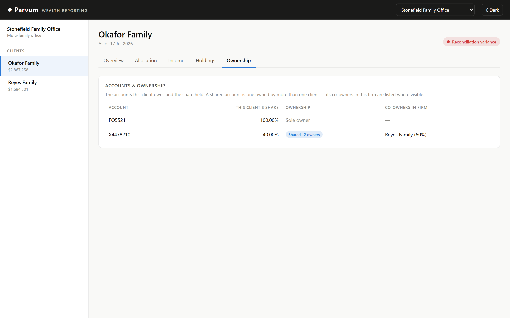
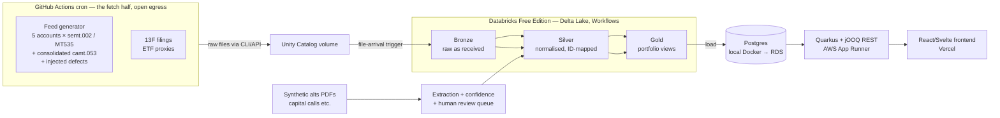

# Parvum — a wealth-data platform reference build

[](https://github.com/ambarshukla/parvum/actions/workflows/ci.yml)

A small, honest reference implementation of a wealth-management data platform,
built end-to-end from open and synthetic data: custodial feeds in **real wire
formats** → normalisation against a **securities master** → **reconciliation &
data-quality control** → a **total-portfolio view** served by Java web
services and a React dashboard — plus a human-in-the-loop pipeline for
alternatives documents, and an infra/observability wrapper.

The interesting constraint: the feeds are synthetic but the *formats* are real
(ISO 20022, SWIFT MT), seeded with real reference data and real SEC 13F
holdings, with defects injected deliberately — because the defects are what
drive reconciliation and data-quality work in practice.

## Stack

Built as a full vertical slice — ingestion, a Databricks lakehouse, data
quality, a Java API, and a web front end — each layer its own package with its
own tests and CI.

| Layer | Technologies | Code |
|-------|--------------|------|
| Lakehouse & pipeline | **Databricks** (Delta Lake, Unity Catalog, Workflows), **PySpark** — bronze → silver → gold | [`spark/`](spark/) |
| Custodial feeds & formats | **Python**, ISO 20022 (`semt.002`, `camt.053`), SWIFT `MT535`, defect injection | [`ingest/`](ingest/) |
| Reference & enrichment | **Python**, OpenFIGI security master, ECB FX, ownership graph | [`reference/`](reference/) |
| Reconciliation & data quality | **PySpark**, findings graded against defect manifests | [`spark/dq_recon.py`](spark/dq_recon.py) |
| Serving API | **Java 21**, **Quarkus**, **jOOQ**, **Flyway**, **PostgreSQL** (schema-per-tenant) | [`serving/`](serving/) |
| Gold → Postgres export | **Python**, `psycopg`, SQL Statements API | [`export/`](export/) |
| Web dashboard | **React**, **TypeScript**, **Vite**, **Recharts** | [`web/`](web/) |
| CI/CD & automation | **GitHub Actions** — per-package PR checks + a daily feed cron | [`.github/workflows/`](.github/workflows/) |
| Local infra | **Docker Compose** (Terraform planned) | [`infra/`](infra/) |

Design decisions are written up in [docs/DECISIONS.md](docs/DECISIONS.md)
(D-001…D-032); the running narrative is in [docs/BUILD_LOG.md](docs/BUILD_LOG.md).


The dashboard also surfaces the ownership graph — including an account shared
60/40 between two families, with its co-owner named:



## Architecture (target)



Key split: **Databricks Free Edition has no open internet access**, so all
external fetching runs in GitHub Actions and lands files for Databricks to
process. Serving infra is provisioned on **real AWS by Terraform** (decision
[D-005](docs/DECISIONS.md)).

## Phases

| # | Phase | Status |
|---|-------|--------|
| 0 | Foundations — repo, local Postgres, docs | ✅ done |
| 1 | Custodial feed ingestion → Bronze (semt.002, MT535, camt.053) | ✅ done |
| 2 | Reference data & normalisation → Silver | ✅ done |
| 3 | Reconciliation & data-quality control | ✅ done |
| 4 | Portfolio aggregation & ownership graph → Gold | ✅ done |
| 5 | Java serving layer (Quarkus + jOOQ) + live site | 🔨 in progress |
| 6 | Alternatives HITL pipeline | ⬜ |
| 7 | Liquidity & scenario projection view | ⬜ |
| 8 | External analytics integration (mocked) | ⬜ |
| 9 | Terraform + Grafana/Prometheus + PagerDuty | ⬜ |

## Quickstart

Prereqs: Docker Desktop (Linux containers), GNU make, git, Python 3.

```sh
make up      # start local Postgres 16, wait until healthy
make psql    # open a SQL shell
make help    # list all targets
```

Optional: `cp .env.example .env` to override local DB credentials/port.

### The feed pipeline

```sh
make fetch-13f                     # sync the local 13F filing store from SEC EDGAR
make generate                      # ~90 business days of feeds into data/raw
make generate DAYS=1               # just today's delivery
make generate DAYS=1 END=2026-07-10  # replay one historical day, byte-identically
make land                          # upload data/raw to the Unity Catalog volume
```

`make land` needs `DATABRICKS_HOST` in `.env` plus a Databricks CLI login. The
same two commands run unattended on weekdays via
[`daily-feeds.yml`](.github/workflows/daily-feeds.yml) — CI has no code path of
its own, it just sets `DAYS=1`.

Landing a file is all it takes: a **file-arrival trigger** starts the bronze
job, so nothing downstream has to know when the feed runs.

```sh
make deploy-job   # apply databricks.yml (the job defined as code)
make run-job      # run the whole chain now, without waiting for a file
```

The full loop — generate → land → bronze → silver → reconciliation → gold reports — runs with no human in it, on a file-arrival trigger.

### Run the site locally (API + dashboard)

The serving API and the dashboard run on your machine against the local
Postgres. You need a **JDK 21** (for the Java API), **Node 20+** (for the web
app), and Docker running. Use three terminals:

```sh
# Terminal 1 — start Postgres, then the API (hot-reload) on :8080
make up
make serving-run        # needs JDK 21 on PATH or JAVA_HOME set

# Terminal 2 — fill the projection tables from gold (one time; needs .env)
make export-gold        # needs a Databricks login + DATABRICKS_* in .env

# Terminal 3 — start the dashboard on :5173 (proxies the API)
make web-install        # first run only
make web-dev
```

Then open **http://localhost:5173**. Pick an advisory firm in the top bar, a
client in the sidebar, and browse the tabs. The dashboard is a static app that
only reads the API — nothing to deploy to look at it locally.

## Repo layout

| Dir | Contents | Phase |
|-----|----------|-------|
| `ingest/` | feed generator + format parsers (Python) | 1 |
| `spark/` | Databricks notebooks/jobs — bronze/silver/gold | 1–4 |
| `reference/` | account universe, ownership graph, securities master (OpenFIGI), issuer domiciles, ECB FX rates | 2–4 |
| `export/` | gold → serving-Postgres exporter (Python) | 5 |
| `serving/` | Quarkus + jOOQ REST API | 5 |
| `web/` | React dashboard over the serving API (Vite + TypeScript) | 5 |
| `alts-hitl/` | PDF extraction + review queue | 6 |
| `infra/` | docker-compose now; Terraform later | 0, 9 |
| `docs/` | [ARCHITECTURE](docs/ARCHITECTURE.md) · [DECISIONS](docs/DECISIONS.md) · [GLOSSARY](docs/GLOSSARY.md) · [BUILD_LOG](docs/BUILD_LOG.md) | all |
