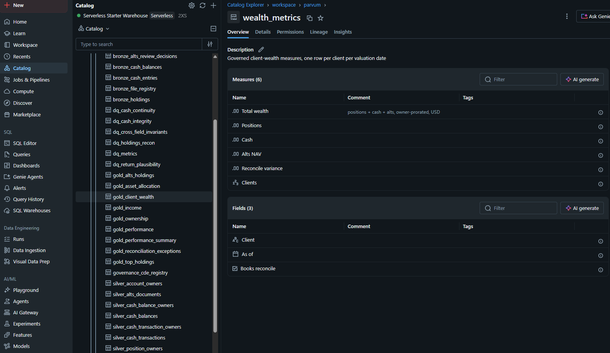
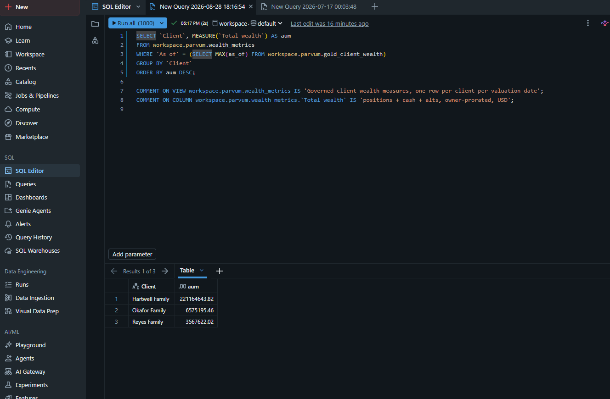
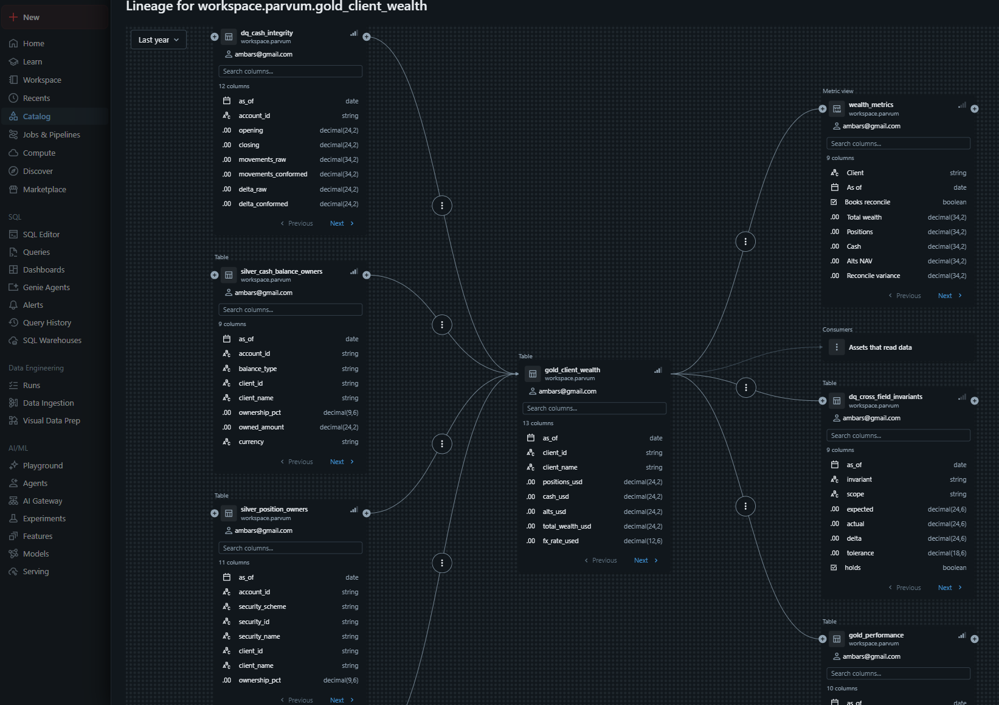
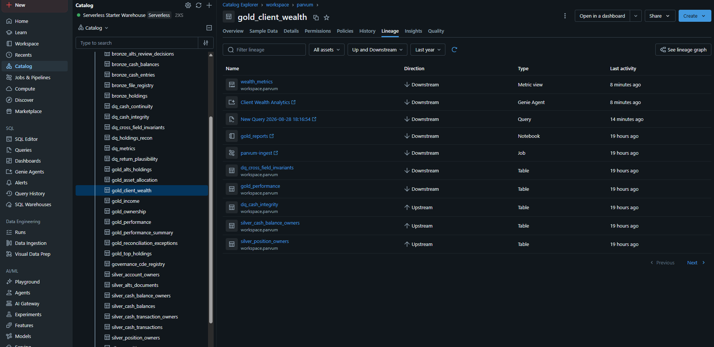
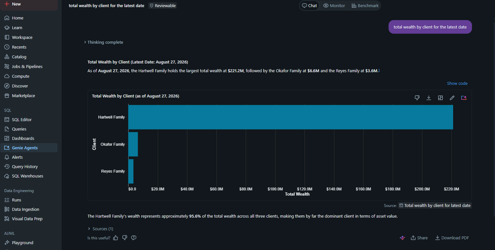
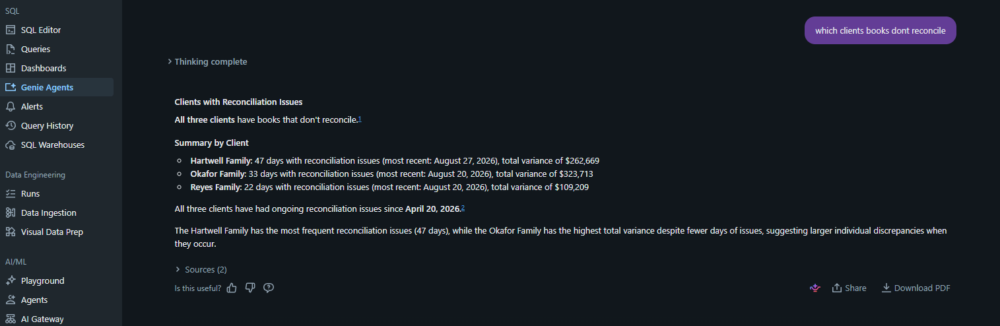
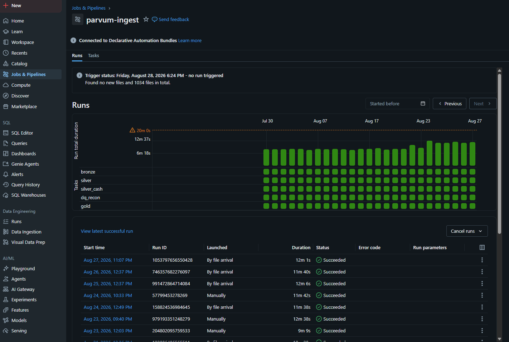

# Semantic layer — governed measures and AI/BI

Gold hands every consumer the same tables. It does not hand them the same
**definitions**: "total wealth" is `SUM(total_wealth_usd)` grouped the right
way, and every dashboard, notebook, and ad-hoc query re-expresses that by hand.
A semantic layer lifts the definition up into Unity Catalog, once, so SQL, BI,
and an AI assistant all resolve the term identically.

This is the layer above the [CDE register](../governance/cde_registry.yml):
the register classifies every published *column* and a CI gate keeps it honest;
the semantic layer names the *measures* a person actually asks for and binds
each to a governed column.

## The metric view

`workspace.parvum.wealth_metrics` is a Unity Catalog **metric view** — a YAML
spec of dimensions and measures over a single source table
(`gold_client_wealth`). It stores no data; it is a governed query surface. Six
measures, three dimensions, each carrying a column comment that is the
*business* definition, not the technical one.



The definition lives in the repo at
[`spark/metric_views/wealth_metrics.sql`](../spark/metric_views/wealth_metrics.sql)
and is applied with `make metric-views` (or pasted into the SQL editor). A
metric view is a catalog object, not a Delta table, so the bronze → gold job
does not create it — it is versioned and re-applied on its own.

### Querying it

Measures are referenced through `MEASURE()`; dimensions are grouped normally.
The aggregation is fixed by the spec, so a consumer picks the grain and never
re-writes the `SUM`:

```sql
SELECT `Client`, MEASURE(`Total wealth`) AS aum
FROM   workspace.parvum.wealth_metrics
WHERE  `As of` = (SELECT MAX(as_of) FROM workspace.parvum.gold_client_wealth)
GROUP  BY `Client`
ORDER  BY aum DESC;
```



## It is lineage-tracked

Unity Catalog treats the metric view like any other object. `gold_client_wealth`
shows it downstream — with its nine columns — alongside `dq_cross_field_invariants`,
`gold_performance`, and the consumers that read it; the silver tables the gold
table is built from sit upstream. The semantic layer is inside the lineage
graph, not bolted onto its edge.



The table view names the Genie space as its own object type ("Genie Agent"),
downstream of the metric view it reads:



## AI/BI Genie over the layer

A Genie space ("Client Wealth Analytics") is pointed at the metric view. A
plain-language question resolves to the **governed** measure — not an
aggregation the model reinvented — and the answer cites the metric view as its
source.



"Show code" on that answer confirms it: the generated SQL calls `MEASURE()` on
the "Total wealth" measure of `workspace.parvum.wealth_metrics` — the governed
measure, not a `SUM` the model wrote itself.


The next question crosses from the headline number into the data-quality
columns on the same view — one vocabulary for both.



## Why this is the governance story, not a BI feature

An AI assistant reading this layer inherits the four properties a new analyst
needs before they can use a dataset unaided — **lineage** (Unity Catalog tracks
it), **schema** (the spec is explicit), a **quality signal** (the same view
exposes `Books reconcile` and `Reconcile variance`), and a **definition** of
each term (the column comments). That set is the whole content of
"AI-ready" — which is why the semantic-layer work and the governance work are
the same work.

It sits on top of a live pipeline: `gold_client_wealth` is rebuilt by the
`parvum-ingest` job on every custodial-feed arrival, so the measures move when
the data does.



## The other two views, and one deliberate refusal

`allocation_metrics` covers what the wealth is made of; `performance_metrics`
covers the daily performance series. The second is the interesting one, for
what it does **not** expose.

`gold_performance` carries `daily_twr_return` and `twr_index_since_inception`,
and neither is a measure here. A time-weighted return over a period is the
**chain-linked product** of its daily factors — not their sum, and not their
average. A metric view measure is an aggregate expression, so
`AVG(daily_twr_return)` would happily produce a number at any grain a consumer
picked, and that number would be wrong in a way nothing on the screen would
reveal. The view therefore exposes the additive components a return is built
from (wealth, flows, restatement adjustment) and leaves the chained figures in
`gold_performance_summary`, computed once by the job that knows how.

`allocation_metrics` makes the same refusal about `weight`: a share is only
meaningful at the grain it was computed for, so the additive component is
exposed and the ratio is left to be derived at whatever grain the consumer
picked.

**A semantic layer that declines to expose a measure it cannot make safe is
doing its job.** The alternative — a measure that is correct at one grain and
silently wrong at others — is worse than no measure, because it looks like an
answer.

## The gate governs the semantic layer too

An eighth gate rule, `undefined_measure`, fails the build when a metric view
publishes a measure or dimension with no business definition. A measure called
`Total wealth` looks self-explanatory and is nothing of the sort — an AI
reading the catalog binds the term to whatever text sits beside it, so an
uncommented measure is one a model will guess about. This is what makes the
semantic contract a contract rather than a naming convention.

## Limits (Free Edition, and honest scope)

- Three metric views over three gold tables. Income, top holdings, ownership
  and alts are still reachable only as raw tables, which is the honest limit of
  the governed vocabulary today.
- The measures are governed for *definition* (every one must carry one) but not
  yet *classified* in the register's tier model the way columns are.
- The Genie space is configured in the workspace; the metric view it reads is
  in git, its instruction text is not.
- Free Edition provides a single serverless warehouse with daily usage limits —
  this is a reference-scale deployment, not a capacity test.
