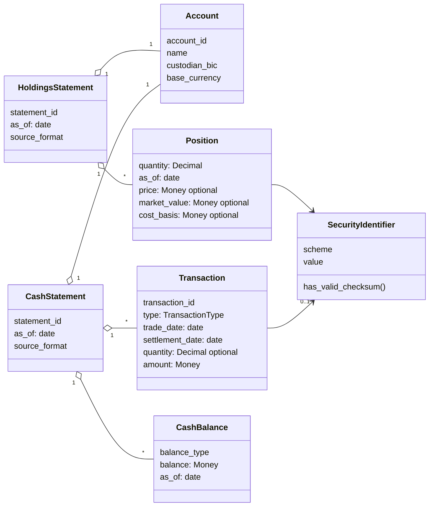

# ingest/

The ingestion layer: canonical model, feed generator, and wire-format
parsers (Python 3.12, managed with [uv](https://docs.astral.sh/uv/)).
Emits the same synthetic portfolios as semt.002, MT535 and camt.053 with
configurable injected defects, and parses them back to the common model.

## Layout

```
src/parvum_ingest/
  model.py         # canonical model — the hub every format maps to/from
  book.py          # deterministic seed book (real ISINs) the generator renders
  defects.py       # config-driven defect injection + ground-truth manifest
  formats/
    _xml.py        # shared ISO 20022 XML helpers
    semt002.py     # ISO 20022 semt.002: render + parse (spec-shaped subset, D-010)
    mt535.py       # SWIFT MT535: render + parse (fixed-tag blocks, decimal commas)
    camt053.py     # ISO 20022 camt.053 cash statement: balances + entries
tests/             # pytest suite; every guarantee has a test, incl. round trips
```

Hub-and-spoke: each feed format (semt.002, MT535, camt.053) gets a renderer
(model → wire format, used by the generator) and a parser (wire format →
model). N formats cost N spokes, not N×N conversions.

## The canonical model



The `optional` fields are deliberate: their absence in a feed is a defect
the data-quality layer detects (D-009), so the model must represent it.
This diagram is hand-maintained (Mermaid, rendered by GitHub); the code in
`model.py` is the source of truth — update both together. A JSON Schema
contract for any model is one call away: `Position.model_json_schema()`.

Models validate **shape** (types, formats, required fields), never
**sense** (business plausibility) — defective-but-parseable data must reach
the data-quality layer, not crash at the boundary. See `docs/DECISIONS.md`
D-009.

## Commands

```sh
uv sync               # create .venv and install pinned dependencies
uv run pytest         # tests        (or: make test, from repo root)
uv run ruff check .   # lint         (or: make lint)
```

Try it — render a statement and parse it back:

```sh
uv run python -c "
from datetime import date
from parvum_ingest import build_book
from parvum_ingest.formats.semt002 import render_semt002, parse_semt002
xml = render_semt002(build_book(date(2026, 7, 15)))
print(xml[:800])
assert parse_semt002(xml).positions[0].security_name == 'Apple Inc'
"
```

The two holdings formats deliberately carry different subsets: semt.002 has
account details but no cost basis; MT535 has cost basis (smuggled through a
`:70E:` narrative, as real feeds do) but references the account by id alone.
Same book, two feeds that disagree — reconciliation's raw material.

The cash statement (camt.053) carries its own tested invariant: closing
balance = opening + net of entries — the arithmetic truth reconciliation
checks and defect injection will deliberately break.

Defects are injected deterministically from a seed and every injection is
recorded in a manifest — the ground truth that later measures whether the
data-quality layer caught everything that was seeded. Semantic defects
(missing cost basis, mistyped ISINs, duplicated/dropped/shifted entries)
produce files that parse fine but lie; syntactic defects (truncation)
fail at the parser.

Generate the raw pile (from the repo root):

```sh
make generate    # ~90 days of business-day deliveries into data/raw/date=YYYY-MM-DD/
```

Ground-truth manifests go to `data/manifests/` — outside the landing
directory, because the pipeline must never see them (D-011).

Status: canonical model + seed book (holdings & cash) + all three formats
+ defect injection + generator CLI. Next: bronze landing on Databricks.
