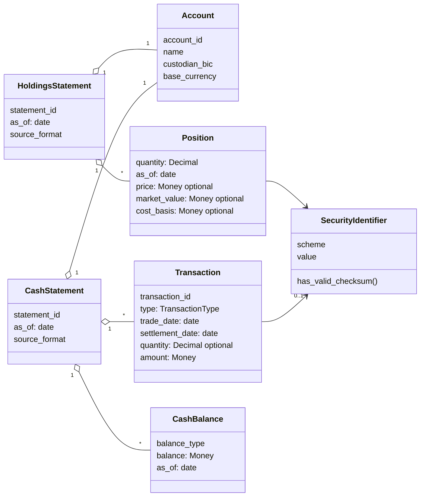

# ingest/

The ingestion layer: canonical model, feed generator, and wire-format
parsers (Python 3.12, managed with [uv](https://docs.astral.sh/uv/)).
Emits the same synthetic portfolios as semt.002, MT535 and camt.053 with
configurable injected defects, and parses them back to the common model.

## Layout

```
src/parvum_ingest/
  model.py      # canonical model — the hub every format maps to/from
tests/          # pytest suite; every guarantee the model makes has a test
```

Hub-and-spoke: each feed format (semt.002, MT535, camt.053) gets a renderer
(model → wire format, used by the generator) and a parser (wire format →
model). N formats cost N spokes, not N×N conversions.

## The canonical model



The `optional` fields are deliberate: their absence in a feed is a defect
the data-quality layer detects (D-009), so the model must represent it.
This diagram is hand-maintained (Mermaid, rendered by GitHub); the code in
`model.py` is the source of truth — update both together. A JSON Schema
contract for any model is one call away: `Position.model_json_schema()`.

Models validate **shape** (types, formats, required fields), never
**sense** (business plausibility) — defective-but-parseable data must reach
the data-quality layer, not crash at the boundary. See `docs/DECISIONS.md`
D-009.

## Commands

```sh
uv sync               # create .venv and install pinned dependencies
uv run pytest         # tests        (or: make test, from repo root)
uv run ruff check .   # lint         (or: make lint)
```

Status: canonical model only. Generator and parsers arrive in subsequent PRs.
